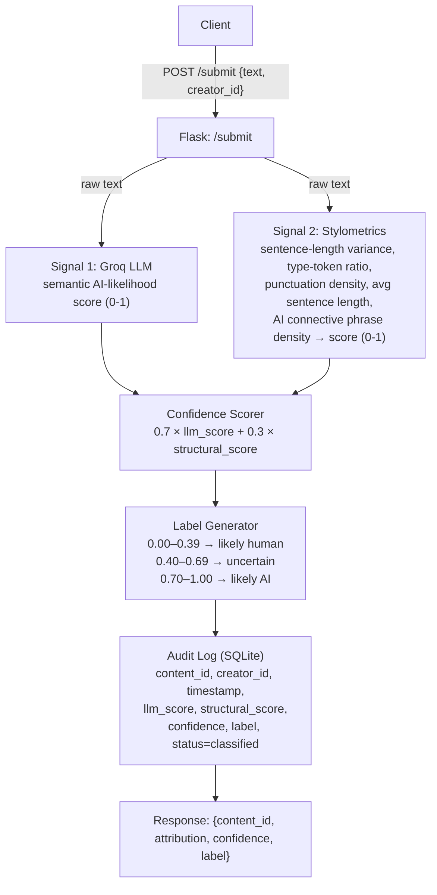
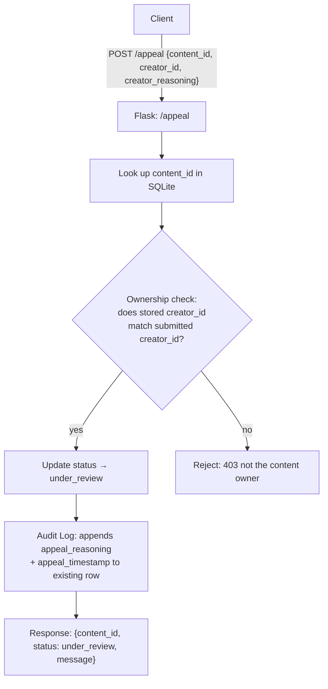

# Provenance Guard

A backend classification system that detects whether submitted text-based content was written by a human or generated by AI. Built for creative platforms where attribution matters — the goal isn't to police AI use, it's to give audiences honest context and give creators a path to appeal if they're misclassified.

---

## Architecture Overview

A submitted piece of text takes the following path through the system:

1. `POST /submit` receives `{text, creator_id}` and generates a unique `content_id`
2. The text is passed to both detection signals
3. **Signal 1** (Groq LLM) returns a semantic AI-likelihood score (0–1)
4. **Signal 2** (Stylometric heuristics) returns a structural AI-likelihood score (0–1), or `null` if the text is too short to analyze reliably
5. The **Confidence Scorer** combines both signals into a single weighted score
6. The **Label Generator** maps that score to one of three transparency label zones
7. Everything — both signal scores, confidence, label, creator, and timestamp — is written to the **SQLite audit log**
8. The response returns `content_id`, `attribution`, `confidence`, `label`, and both raw signal scores

For appeals, the path is simpler: `POST /appeal` receives `{content_id, creator_id, creator_reasoning}`, verifies the creator owns the content, updates the status to `under_review`, and logs the reasoning alongside the original decision in the same row.

### Submission Flow



### Appeal Flow



SQLite serves double duty here — it's both the audit log and the lookup table the appeal endpoint uses to verify ownership. There's no separate review queue service; `GET /log` filtered by `status = under_review` is the review queue.

---

## Detection Signals

### Signal 1 — LLM-based classification (Groq `llama-3.3-70b-versatile`)

Measures holistic semantic and stylistic coherence — does the text read the way an LLM tends to write, in tone, structure, and word choice? It's prompted to return a single float between 0.0 and 1.0 representing AI-likelihood. Temperature is set to 0.1 to keep outputs consistent, and `max_tokens` is capped at 10 since we only need a number back.

**Why this signal:** It's the most direct way to ask the question. An LLM that has seen enormous amounts of both human and AI writing is well-positioned to assess stylistic coherence holistically in a way that pure statistics can't.

**Blind spot:** Well-polished human writing with formal structure can score high, and AI text that's been heavily prompted to sound casual can score low. The model is also assessing its own kind, which creates a subtle reliability concern for newer or less conventional AI outputs.

### Signal 2 — Stylometric heuristics (plain Python)

Measures five structural and statistical properties of the text, each of which tends to differ between human and AI writing:

| Sub-metric | What it captures |
|---|---|
| Sentence length uniformity (CV) | AI tends to write sentences of similar length; human writing is more irregular |
| Type-token ratio | Low vocabulary diversity is AI-like; high diversity is human-like |
| Formal punctuation density | Commas, semicolons, and colons per word — AI uses more formal connective punctuation |
| Average sentence length | AI sentences tend to be longer and denser (20+ words each) |
| AI connective phrase density | Phrases like "furthermore", "it is important to note", "in conclusion" are strong AI markers |

Each sub-metric is normalized to 0–1 and averaged into a single structural score. If the text has fewer than 2 sentences or 10 words, the signal returns `null` and the system falls back to the LLM score alone rather than injecting a neutral 0.5 that would bias the result toward uncertain regardless of what the LLM found.

**Why this signal:** It's entirely independent of the LLM signal — it measures surface-level form rather than semantic content, so the two capture genuinely different properties of the text. A two-signal system that agrees is more reliable than either alone.

**Blind spot:** By only looking at form, AI text explicitly prompted to use irregular sentence structure or casual vocabulary will largely defeat this signal. It's more useful as a corroborating signal than a primary classifier.

---

## Confidence Scoring

Both signals produce a score, combined into a single confidence value:

```
confidence = 0.7 × llm_score + 0.3 × structural_score
```

The LLM signal gets higher weight because the stylometric signal is less effective in practice — surface-level metrics produce weak discrimination on short texts and can be gamed by AI prompted to write casually. The structural signal is useful for corroboration but not reliable enough to lead.

The thresholds are intentionally asymmetric:

| Confidence | Zone |
|---|---|
| 0.00 – 0.39 | Likely human |
| 0.40 – 0.69 | Uncertain |
| 0.70 – 1.00 | Likely AI |

Content needs to score above 0.70 to be labeled as likely AI — that's a high bar by design. A false positive where a human's work gets flagged as AI is more damaging than a false negative where AI-generated content gets labeled human. The asymmetry reflects that.

### Example submissions

**High-confidence AI** — a 5-paragraph essay on AI and labor markets:
```json
{
  "llm_score": 0.90,
  "structural_score": 0.6458,
  "confidence": 0.8237,
  "attribution": "likely_ai"
}
```

**Low-confidence human** — a personal journal entry about a solo trip:
```json
{
  "llm_score": 0.10,
  "structural_score": 0.2899,
  "confidence": 0.1570,
  "attribution": "likely_human"
}
```

These two sit at opposite ends of the confidence range (0.82 vs 0.16) because both signals agree strongly in each direction. The asymmetry becomes visible in borderline cases, where content lands in `uncertain` rather than being forced into a binary decision.

### Validation

To validate that scores produce meaningful variation, 40 labeled samples (20 AI, 20 human) of varying lengths were run through the pipeline:

- **Overall accuracy:** 90% correctly labeled, 10% returned `uncertain`, 0% outright wrong
- **Human accuracy:** 100% — the LLM scored human text at 0.0–0.1 consistently across all 20 samples
- **AI accuracy:** 80% correctly labeled `likely_ai`, 20% returned `uncertain` (zero false negatives)
- **Long text accuracy:** 100% — both signals get more reliable with more content to analyze

The 20% uncertain rate on AI samples reflects the conservative threshold working as intended, not a classification failure. Every uncertain case had confidence between 0.65–0.69, just below the 0.70 cutoff.

---

## Transparency Label

The raw confidence score isn't shown to the end reader — a value like 0.58 has no meaning to a non-technical user. Instead it maps to one of three labels:

| Zone | Exact label text |
|---|---|
| Likely AI (confidence ≥ 0.70) | `"This content is likely AI-generated"` |
| Uncertain (confidence 0.40–0.69) | `"We're not confident enough to label this content as AI or human-created"` |
| Likely Human (confidence < 0.40) | `"This content is likely human-created"` |

The word choices *created* and *generated* are intentional — they don't lock the system into written content only, leaving the door open for multimodal content moderation down the line.

The raw confidence score remains accessible in the API response and in the audit log for creators who want to understand their classification in more detail, for example when reviewing an appeal.

---

## Rate Limiting

Rate limiting is applied to `POST /submit` via Flask-Limiter:

```
10 requests per minute
100 requests per day
```

**Per-minute reasoning:** A real writer submitting their own work doesn't submit 10 pieces in a single minute. This limit blocks automated flooding while leaving genuine individual use completely unaffected.

**Per-day reasoning:** 100 submissions per day is a generous ceiling for any individual creator. It's not a practical constraint on legitimate users — it's a guard against scripted abuse.

Requests exceeding either limit receive a `429 Too Many Requests` response. Verified by sending 12 rapid requests and observing the first 9 return `200` and requests 10–12 return `429`.

---

## Appeals Workflow

Only the original creator can appeal a classification. The appeal endpoint verifies ownership by matching the `creator_id` submitted in the appeal against the one stored at submission time. A mismatched `creator_id` returns a `403`.

A valid appeal:
1. Updates the submission's status from `classified` to `under_review`
2. Logs the `creator_reasoning` and `appeal_timestamp` alongside the original decision in the same SQLite row
3. Returns confirmation to the creator

A human reviewer opening the appeal queue (`GET /log` filtered by `status = under_review`) would see the original submitted text, both signal scores, the confidence and label, the original submission timestamp, the appeal timestamp, and the creator's reasoning for contesting the decision. No automated re-classification occurs — the original classification is unlikely to change without new information, and the decision warrants human judgment.

Duplicate appeals on the same content are blocked with a `409`.

---

## Audit Log

Every attribution decision is logged to SQLite. Each entry captures:

| Field | Description |
|---|---|
| `content_id` | Unique identifier for the submission |
| `creator_id` | Who submitted it |
| `timestamp` | When it was submitted (local time) |
| `llm_score` | Raw Signal 1 output |
| `structural_score` | Raw Signal 2 output (`null` if text was too short) |
| `confidence` | Combined weighted score |
| `attribution` | Zone: `likely_ai`, `uncertain`, or `likely_human` |
| `label` | Full transparency label text |
| `status` | `classified` or `under_review` |
| `appeal_reasoning` | Populated if an appeal was filed |
| `appeal_timestamp` | When the appeal was submitted |

The log is accessible via `GET /log`, which returns the 50 most recent entries ordered by insertion time.

**Sample log output (3 entries):**
```json
{
  "entries": [
    {
      "content_id": "5a7bc450-116e-47ac-a3ec-7b3bea00503b",
      "creator_id": "long-ai-1",
      "timestamp": "2026-06-29 10:31:22 PM",
      "llm_score": 0.9,
      "structural_score": 0.6458,
      "confidence": 0.8237,
      "attribution": "likely_ai",
      "label": "This content is likely AI-generated",
      "status": "classified",
      "appeal_reasoning": null,
      "appeal_timestamp": null
    },
    {
      "content_id": "498f2adb-d977-4c7e-9e09-ba535ede5cc0",
      "creator_id": "creator-jane",
      "timestamp": "2026-06-29 10:52:39 PM",
      "llm_score": 0.0,
      "structural_score": 0.1796,
      "confidence": 0.0539,
      "attribution": "likely_human",
      "label": "This content is likely human-created",
      "status": "under_review",
      "appeal_reasoning": "I wrote this myself from personal experience. My informal writing style and use of casual language may have triggered the classifier unfairly.",
      "appeal_timestamp": "2026-06-29 10:52:43 PM"
    },
    {
      "content_id": "0773a0f3-930c-4494-9272-7a5d251fd6f2",
      "creator_id": "long-human-1",
      "timestamp": "2026-06-29 10:18:45 PM",
      "llm_score": 0.1,
      "structural_score": 0.3379,
      "confidence": 0.2189,
      "attribution": "likely_human",
      "label": "This content is likely human-created",
      "status": "classified",
      "appeal_reasoning": null,
      "appeal_timestamp": null
    }
  ]
}
```

---

## Known Limitations

**1. Human writing with intentional structure or rhythm**
Poetry, song lyrics, or formal prose with deliberate repetitive structure will likely score high on the structural signal and get nudged toward AI-generated even if the uniformity is an intentional human choice. The stylometric signal has no way to distinguish "uniform because it's AI" from "uniform because the author chose to write that way." This is probably the most likely source of false positives in a real creative platform deployment.

**2. AI-generated content explicitly prompted to sound human**
Text generated with a prompt like "use irregular sentence structure and a casual tone" can largely defeat the structural signal since it primarily measures surface-level shape, which prompting can directly target and fake. The LLM signal is more robust against this but is not immune — if the output genuinely reads as human, the LLM may score it accordingly.

---

## Spec Reflection

**One way the spec helped:** Writing out the asymmetric thresholds in planning.md before touching any code meant that when testing showed AI text landing in `uncertain` rather than `likely_ai`, there was already a principled reason not to treat that as a bug. The spec made clear that the 0.70 cutoff was a deliberate design choice to protect against false positives, not an arbitrary number to be tuned upward the moment a test case didn't come out clean.

**One way implementation diverged:** The original spec called for equal weighting between the two signals — `confidence = (llm_score + structural_score) / 2`. During Milestone 4 testing across 40 samples, the stylometric signal consistently scored AI text in the 0.30–0.46 range, well below what would be needed to contribute meaningfully at equal weight. The weighting was adjusted to 70/30 (LLM/structural) to reflect the actual reliability gap between the two signals. The spec already acknowledged equal weighting was "a good baseline, not an optimal solution" — testing just made clear how large the gap actually was.

---

## AI Usage

**Instance 1 — Flask skeleton and Signal 1:**
Claude was given the Detection Signals section of planning.md and the submission flow diagram and asked to generate the Flask app skeleton with the `POST /submit` route and the Groq LLM signal function. The generated code had the app running on the default Flask port 5000, which macOS AirPlay silently hijacks — every request was returning a 403 from Apple's process rather than Flask. The port was changed to 5001. The signal prompt and output-parsing logic were also reviewed against the spec before being wired into the route.

**Instance 2 — Stylometric signal revision:**
Claude generated the initial stylometric signal using the three metrics specified in planning.md: sentence length variance, type-token ratio, and punctuation density. Testing across multiple text samples showed structural scores capping at 0.29–0.43 for clearly AI text, not enough to meaningfully contribute to the combined score. The signal was revised to add two additional sub-metrics — average sentence length and AI connective phrase density (e.g. "furthermore", "it is important to note", "in conclusion") — which raised the ceiling for AI text to 0.60–0.68 and produced the separation needed for the weighted formula to be effective.
