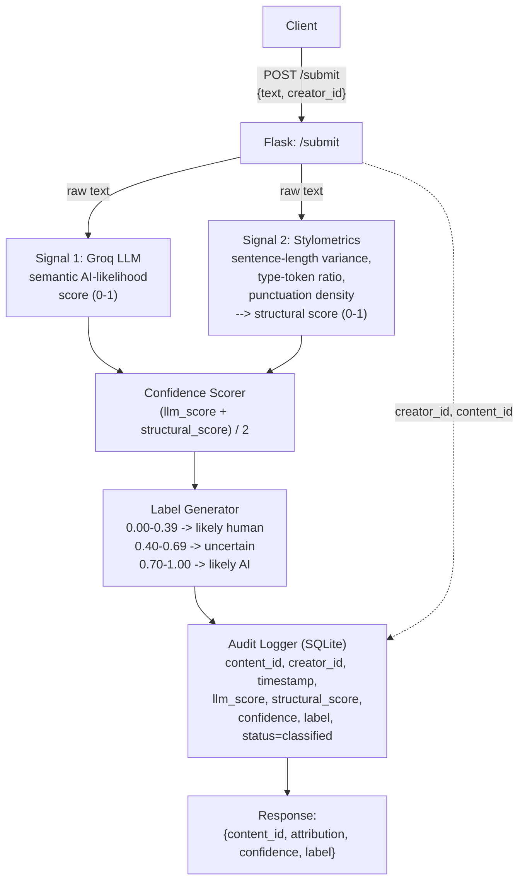
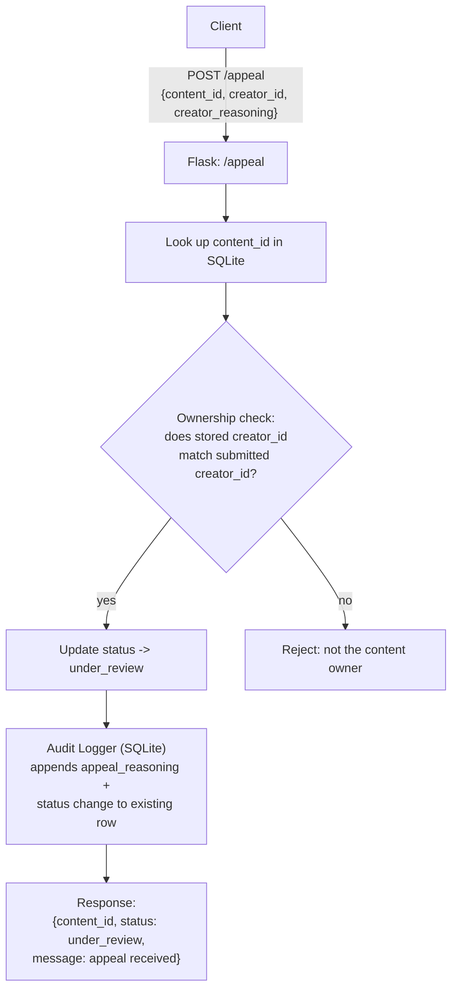

# Provenance Guard

## Detection Signals

### 1. LLM-based classifcation (Groq llama-3.3-70b-versatile)

Measures holistic semantic and stylistic coherence, does the text read the way an LLM tends to write, in tone, strucutre, and word choice? Outputs a 0-1 AI-likelihood score derived from a structured prompt asking the model to analyze the inputted text. **Blind spot**: it could be fooled by Ai generated text that is extensively prompted to sound human, or by well-polished human text of high formal quality that posses machine-like features.

### 2. Stylometric heuristics (plain Python)

Measure sthe structural/statiscal properteis, sentecne length variance, type-token ratio (vocabulary diversity), punctuation density. AI-generaed text tends to be more uniform while human writing tends to be more variable. Outputs a 0-1 score derived from combinign the aforementioned metrics. **Blind spot**: By just looking at form an AI-generated text that is explicitly told to have varying vocabulary choices or varying sentence length will likely pass this test.

The combined probabilistic score uses a weighted average: `confidence = 0.7 * llm_score + 0.3 * structural_score`. The LLM signal receives higher weight because the stylometric signal is less effective — surface-level metrics like sentence length variance and type-token ratio produce weak discrimination on short texts and can be easily mimicked by AI prompted to write casually, making it a useful corroborating signal but not a reliable primary classifier.

## Uncertainty Representation

A confidence score gives me a single 0-1 float, the average of the indpendent signal scores, it maps us to three different zones of confidence:

| Confidence Score| Zone |
|---|---|
| 0.00-0.39 | `Likely human` |
| 0.40-0.69 | `Uncertain` |
| 0.70-1.00 | `Likely AI` |

This split is intentionall asymmetric rather than a clean 50/50. Content needs to score above 0.70 to be labelled as likely AI and below 0.40 tobe labelled as likely human. The reason for this disparity is because a false positive where human work is labelled as AI-generated is more damaging than a false negative where AI-generated work is labeled as human.

## Transparency Label Design  

| Zone | Label |
|---|---|
| `Likely human` | This content is most likely human-created |
| `Uncertain` | It is uncertain whether this content is human or AI-generated |
| `Likely AI` | This content is most likely AI-generated |

The raw confidence score is not shown to the end reader, a seemingly arbitrary value like 0.58 has no meaning to a non-technical use, so rather the confidence is transformed into a meaningful label. However, in the case that a user wants to access their raw scorem it remains available in the audit log and in the API response for a creator reviewing their appeal for example.

*Created* and *Generated* are intentional langauge choices that don't lock the project into something only for written-content, but a scalable framework that can be used for multimodal content moderation.

## Appeals Workflow

- Only the creator who owns the content (verified by matching with the `creator_id` at submission) can appeal it.

- An appeal submits the `creator_id`. `content-id`, and `creator_reasoning`.

- At recieval, the system verifies the `creator_id ` matches, if so the status turns to `under_review`, and the appeal reasoning plus id/timestamp are logges alongside the original decision in teh same SQLite row.

- No automated re-calssifcation occurs since it is unlikely the decision will change 

- A human reviewer opening the appeal queue (`Get /log` filtered by status `under_review`) would see the original text, both signal scores, the confidence/label, timestamps for original submission and appeal, and the creators reasoning for appealing.

## Anticipated Edge Cases

**1. Human writing with intentional structure/rhythm:**
Something like poetry, song lyrics, or formal prose with deliberate repetitive structure will liley score high on the stylometric score and get misread as AI-generated even if the uniformity is an intentional human choice.

**2. AI-generated content with explicit prompting**
Text that was AI generated with a prompt including "use irregular sentence structure and a casual tone' can defeat the stylometric signal since that primarily measures surface-level shape, which prompting can directly target and fake.

## Architecture

### Submission Flow
 

 
### Appeal Flow
 

SQLite plays two roles here, both the audit log and the files lookup table that the appeal endpoint uses to verify content ownership. There's no seperate review queue service; `Get /log` filtered by `status = 'under_review'` functions as the review queue for this project. 

## AI Tool Plan

### M3 (submiossion endpoint + first signal) using claude:

Provide the detection signals section above plus the submission-flow half of the architecture design  to the AI tool. Have it generate the Flask app skeleton with the `POST /submit` route stub, and the Signal 1 (Groq) functoin. Verify by directly calling the Groq functoin with a few test inputs before wiring it into the route and confirming the route's request/response shape matches the diagram.

### M4 (second signal + confidence scoring) using claude:

Provide the Detection Signals section, Uncertainty Representation section, and the full diagram. Ask for the Signal 2 (stylometric) function and the confidence-scoring combination logic. Verify by checking that the generated thresholds match this document exactly, and that clearly AI vs clearly human test inputs produce noticeably different combines scores.

### M5 (production layer) using claude:

Provide the Transparancy Label Design sectionm the Appeals Workflow section, and th ediagram. Ask for the label mapping function to the three different strings and the `POST /appeal` endpoint. Verify by generating all three label variants directly against the thresholds, and confirming the appeal endpoint rejects a mismatched `creator_id` ownership and correctly updates tatus + log on a valid matching appeal.